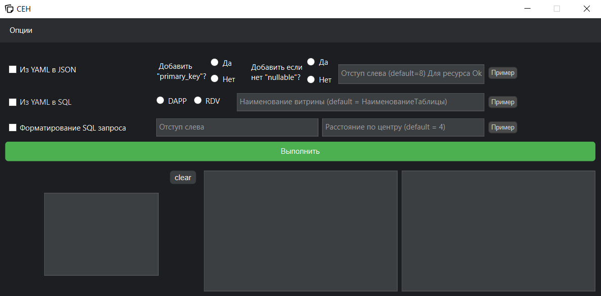

# Описание ПО
<div align="center">
    
</div>

## ПО состоит из двух частей:

1. **Основная часть** – это интерфейс, который вы видите при запуске программы. Она предназначена для выполнения ключевых функций и упрощения работы с данными.
2. **Опции** – открываются при нажатии кнопки "Опции". Этот раздел создан для хранения и организации рабочих процессов.

## Разбор работы ПО

### Основная часть

В основной части программы вы можете работать с различными функциями. Чтобы узнать, что делает каждая функция, нажмите кнопку "Пример" справа. Это откроет демонстрацию с входными и выходными данными для выбранной функции. Это особенно удобно для новых пользователей или для тестирования функционала.

#### Краткое описание функционала:

- **Формирование из YAML в JSON** для создания ресурсов. Эта функция позволяет быстро преобразовывать данные из формата YAML в JSON, что упрощает их дальнейшее использование.
- **Преобразование YAML в SQL**, чтобы использовать готовый скрипт для создания витрин на разных средах.
- **Форматирование SQL-запроса** в удобочитаемый вид.

#### Пример использования функции «YAML в JSON»:

1. Нажмите **"Clear"**, чтобы очистить поле, если что-то ранее было вставлено.
2. Выберите чекбокс напротив функции "YAML в JSON".
3. Укажите необходимые параметры из предложенных RadioButtons.
4. Заполните поле для ввода "отступа слева" (если хотите его изменить), чтобы задать форматирование результирующего SQL-запроса.
5. Нажмите "Выполнить". После этого результат будет отображён в нижнем правом поле, и вы сможете его скопировать.

### Опции

Во второй части программы, которая доступна через "Опции", можно вести заметки для организации работы.

#### Примеры использования заметок:

- **Все мои ветки** – используйте для хранения информации о PR, названиях веток и их статусах.
- **RDV – все скрипты** – храните здесь все запускаемые скрипты для работы.
- **RDV – созданные заявки** – записывайте созданные заявки в dev-среде и контуре.


# Установка ПО
```bash
git clone git@github.com:AleksandrNemanov/ceh.git
cd your-repo
python -m venv venv
.\venv\Source\activate
pip install -r requirements.txt
python main_app.py
```
# Повторный запуск
```bash
Создаем файл ceh.bat и вставляем содержимое
cd C:\Users\Desktop\Ceh
.\venv\Scripts\activate & python main_app.py
